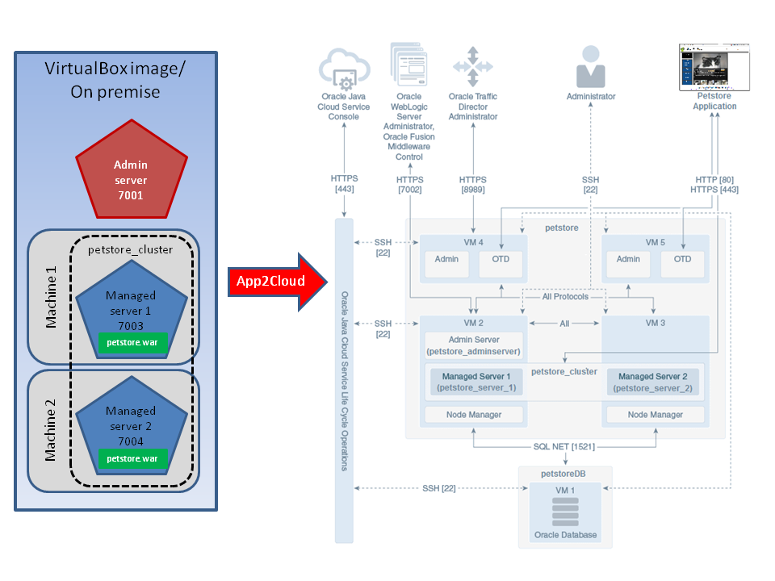

---
# Oracle クラウド・ネイティブ DevOps ワークショップ #
----
## Weblogic 10.3.6 (on-premises) アプリケーションをOracle Java Cloud Serviceに遷移（DB遷移含め） ##

### このチュートリアルについて ###
このユースケースは、Oracle Java Cloud Service の AppToCloud という特性を利用し、Weblogic 10.3.6で実行している JEE5 アプリケーションをOracle・パブリック・クラウド・サービスに遷移すると仮定しています。Oracleの AppToCloud インフラストラクチャー を利用すれば、現行のドマイン・コンフィグレーションとJavaアプリケーションをエクスポートし、同じドマインリソースとアプリケーションで新しい Oracle Java Cloud Serviceのインスタンスを作成することが可能です。下記の図で示しているのは、遷移前後のアーキテクチャです。 Oracle Java Cloud Service の AppToCloud という特性を利用すれば、最低限の介入でクラウドに遷移することが可能です。

<div align="left"></div>

なお、Oracle Database Backup Cloud Serviceを利用し、on-premises の Oracle Databaseをクラウドにバックアップします。Oracle Database Backup Cloud Serviceを使用するには、Oracle Database Cloud Backup Moduleをインストールし、クラウドにバックアップを送信するように環境を構成する必要です。その後にRecovery Manager（RMAN）コマンドを使用して、on-premisesアプリケーションが使用しているOracle Database 12c R1のバックアップを取り、Cloud Storageのコンテナーにバックアップファイルを格納します。Oracle Database Cloud Serviceのインスタンスを作成する際に、Initialize Data From Backup という機能を利用し、バックアップファイルからデータベースのインスタンスを復元します。

**遷移前後のバージョン纏め：**

|           | On-Premises       | Cloud             |
| --------- | ----------------- | ----------------- |
| WebLogic  | 10.3.6 (11g)      | 12.2.1.3 (12cR2)  |
| Oracle DB | 12.1.0.2 (12c R1) | 12.1.0.2 (12c R1) |

**このチュートリアルは下記のことをデモンストレーションしています：**

+ Oracle の AppToCloud ツールを利用し、on-premises の Weblogic 10.3.6 のドマイン・コンフィグレーションとJavaアプリケーションをエクスポートします。

+ Oracle Database の Recovery Manager（RMAN）コマンドを利用し、on-premises の Oracle Database 12c R1バックアップを取ります。

+ Oracle Database Cloud Service の Initialize Data From Backup という機能を利用し、バックアップファイルからインスタンスを作成します。

+ Oracle Java Cloud Service の AppToCloud という機能を利用し、Oracle Java Cloud Service のインスタンスを作成します。

+ エクスポートされたon-premises Weblogic 10.3.6ドメインの一部として、アプリケーションをインポートし、実行します。

  ​

### 前提条件 ###

- このチュートリアルに使うVirtualBox イメージ（別途配布）が必要です。
- Oracleクラウド環境（Java Cloud Servie、Database Cloud Servie、Storage Classic）のアカウントが必要です。

### Steps ###

#### １．on-premises WebLogicドマインの作成及びアプリケーションのデプロイ ####

on-premises のWeblogic 10.3.6 ドマインの作成 及び サンプル・アプリケーションPetstoreのデプロイを行います。事前に用意したVirtualBox イメージの中には、スクリプトを提供しています。このスクリプトを実行することにより、on-premises のデータベースの起動、Weblogic 10.3.6 ドマインの作成、Weblogic サーバーの起動 及び サンプル・アプリケーションPetstoreのデプロイ が全部自動的に完成出来ます。

**Step-1** terminalを立ち上げ、ディレクトリ `GIT_REPO_LOCAL_CLONE/app-2-cloud` に移動します。

	$ [oracle@localhost Desktop]$ cd /u01/content/cloud-native-devops-workshop/app-2-cloud

**Step-2** その配下にあるスクリプト `prepareEnv.sh` を実行します。

このスクリプトは `prepareEnv.sh <db user> <db password> [<PDB name>]`の様に実行してください。事前に用意しているVirtualBox イメージの中で、下記の様にパラメータを渡してください：
```
$ [oracle@localhost app-2-cloud]$ ./prepareEnv.sh system welcome1 pdborcl
Oracle database (sid: orcl) is NOT running. Starting database first.
Processing Database instance "orcl": log file /u01/app/oracle/product/12.1.0/dbhome_1/startup.log
Open pluggable database: pdborcl.
pdborcl is already opened
********** CREATING PetStore DB USER **********************************************

User dropped.


User created.


Grant succeeded.

********** CREATING DB ENTRIES FOR PetStore Application ***************************

SQL*Plus: Release 12.1.0.2.0 Production on Mon Apr 9 20:08:58 2018

Copyright (c) 1982, 2014, Oracle.  All rights reserved.


Connected to:
Oracle Database 12c Enterprise Edition Release 12.1.0.2.0 - 64bit Production
With the Partitioning, OLAP, Advanced Analytics and Real Application Testing options

SQL> 
Table created.
・・・
＜中略＞
・・・
Table created.

1 row created.
・・・
＜中略＞
・・・
1 row created.

Commit complete.

SQL> Disconnected from Oracle Database 12c Enterprise Edition Release 12.1.0.2.0 - 64bit Production
With the Partitioning, OLAP, Advanced Analytics and Real Application Testing options
********** CREATING PETSTORE_DOMAIN (WEBLOGIC 10.3.6 - PETSTORE_DOMAIN) ***********
>  succeed: read template from "/u01/content/cloud-native-devops-workshop/app-2-cloud/template/petstore_domain_template.jar"
>  succeed: find User "weblogic" as u1_CREATE_IF_NOT_EXIST
>  succeed: set u1_CREATE_IF_NOT_EXIST attribute Password to "********"
>  succeed: write Domain to "/u01/wins/wls1036/user_projects/domains/petstore_domain"
>  succeed: close template
********** STARTING ADMIN SERVER (WEBLOGIC 10.3.6 - PETSTORE_DOMAIN) **************
********** STARTING MSERVER1 SERVER (WEBLOGIC 10.3.6 - PETSTORE_DOMAIN) ***********
********** STARTING MSERVER2 SERVER (WEBLOGIC 10.3.6 - PETSTORE_DOMAIN) ***********
********** ADMIN SERVER (WEBLOGIC 10.3.6 - DOMAIN1036) HAS BEEN STARTED ***********
Archive:  ../dpct/domain-templates/Domain1036.jar
  inflating: /u01/content/cloud-native-devops-workshop/app-2-cloud/petstore.12.war  
********** DEPLOY PETSTORE (WEBLOGIC 10.3.6 - PETSTORE_DOMAIN) ********************

Initializing WebLogic Scripting Tool (WLST) ...

Welcome to WebLogic Server Administration Scripting Shell

Type help() for help on available commands

************************ Create resources for PETSTORE application *****************************************
Connecting to t3://localhost:7001 with userid weblogic ...
Successfully connected to Admin Server 'AdminServer' that belongs to domain 'petstore_domain'.

Warning: An insecure protocol was used to connect to the 
server. To ensure on-the-wire security, the SSL port or 
Admin port should be used instead.

Location changed to edit tree. This is a writable tree with 
DomainMBean as the root. To make changes you will need to start 
an edit session via startEdit(). 

For more help, use help(edit)

Starting an edit session ...
Started edit session, please be sure to save and activate your 
changes once you are done.
Saving all your changes ...
Saved all your changes successfully.
Activating all your changes, this may take a while ... 
The edit lock associated with this edit session is released 
once the activation is completed.
Activation completed
************************ Deploy PETSTORE application *****************************************
Deploying application from /u01/wins/wls1036/wlserver_10.3/common/deployable-libraries/jsf-2.0.war to targets petstore_cluster (upload=false) ...
     
.Completed the deployment of Application with status completed
Current Status of your Deployment:
Deployment command type: deploy
Deployment State       : completed
Deployment Message     : [Deployer:149194]Operation 'deploy' on application 'jsf [LibSpecVersion=2.0,LibImplVersion=1.0.0.0_2-0-2]' has succeeded on 'mserver2'
Deploying application from /u01/content/cloud-native-devops-workshop/app-2-cloud/petstore.12.war to targets petstore_cluster (upload=false) ...
     
...Completed the deployment of Application with status completed
Current Status of your Deployment:
Deployment command type: deploy
Deployment State       : completed
Deployment Message     : [Deployer:149194]Operation 'deploy' on application 'Petstore' has succeeded on 'mserver2'
Starting application Petstore.
     
.Completed the start of Application with status completed
Current Status of your Deployment:
Deployment command type: start
Deployment State       : completed
Deployment Message     : [Deployer:149194]Operation 'start' on application 'Petstore' has succeeded on 'mserver2'
No stack trace available.
     
********** OPEN PETSTORE APPLICATION AT http://localhost:7003/petstore/faces/catalog.jsp
[oracle@localhost app-2-cloud]$ 
```
**Step-3** サンプル・アプリケーションPetstoreを確認します。

ブラウザでURL*http://localhost:7003/petstore/faces/catalog.jsp*をアクセスしてください。VirtualBox環境では、二つの管理対象サーバーで組んでいるクラスタに対してロードバランサーが設定されていないです。なので、ポート7003と7004を通って直接に管理対象サーバーをアクセスしています。

<div align="left"></div>


#### ２．AppToCloud で on-premises WebLogicドマインのエクスポート ####

AppToCloud ツールは、事前に用意しているVirtualBox環境に既に入っています。もし、事前に用意しているVirtualBox環境を利用していない場合、[サイト](http://www.oracle.com/technetwork/topics/cloud/downloads/index.html#apptocloud)からダウンロードする必要です。Oracle Java Cloud Service のサービス・コンソールのDownload Centerからダウンロードすることも出来ます。コンソール画面の右上のユーザ名をクリックし、表示されるメニューからHelp→Download Centerを選択してください。このツールは、圧縮ファイル `a2c-zip-installer.zip`となっています。ローカルに保存してください。また、インストールするには、管理サーバ所属のマシンにインストールする必要です。

##### ２．１．`a2c-healthcheck.sh`実行

**Step-1** 今回のワークショップでは、事前に用意しているVirtualBox環境を利用するので、下記の様に、ディレクトリ `/u01/oracle_jcs_app2cloud` に移動し、その配下に `a2c-healthcheck.sh` が存在していることを確認してください。

	[oracle@localhost app-2-cloud]$ ls -la /u01/oracle_jcs_app2cloud/bin
	total 60
	drwxr-xr-x. 2 oracle oracle 4096 Oct 10 09:01 .
	drwxr-x---. 7 oracle oracle 4096 Oct 11 00:16 ..
	-rw-r-----. 1 oracle oracle 7582 Aug  4 11:25 a2c-export.cmd
	-rwxr-x---. 1 oracle oracle 7137 Aug  4 11:25 a2c-export.sh
	-rw-r-----. 1 oracle oracle 8683 Aug  4 11:25 a2c-healthcheck.cmd
	-rwxr-x---. 1 oracle oracle 8169 Aug  4 11:25 a2c-healthcheck.sh
	-rw-r-----. 1 oracle oracle 6095 Aug  4 11:25 a2c-import.cmd
	-rwxr-x---. 1 oracle oracle 5673 Aug  4 11:25 a2c-import.sh

**Step-2** AppToCloudツールの中にあるコマンド`a2c-healthcheck`でOracle Java Cloud Serviceへ遷移するon-premisesのWebLogic サーバ・ドマインとアプリケーションを検証します。このコマンドのパラメータは下記です：

- -oh：WebLogicサーバがインストールしている最上位ディレクトリ。 `ORACLE_HOME`とも呼ばれます。
- -adminUrl：管理サーバのAdministration URL
- -adminUser：管理者のユーザ名
- -outputDir：アーカイブファイル出力先のディレクトリ

コマンド `a2c-healthcheck.sh` で実行しているドマインを検証し、エクスポートします。管理者のパスワードを入力と言われた時に、*welcome1*を入力してください。

	[oracle@localhost app-2-cloud]$ /u01/oracle_jcs_app2cloud/bin/a2c-healthcheck.sh -oh /u01/wins/wls1036 -adminUrl t3://localhost:7001 -adminUser weblogic -outputDir /u01/jcs_a2c_output
	JDK version is 1.8.0_60-b27
	A2C_HOME is /u01/oracle_jcs_app2cloud
	/usr/java/latest/bin/java -Xmx512m -cp /u01/oracle_jcs_app2cloud/jcs_a2c/modules/features/jcsa2c_lib.jar -Djava.util.logging.config.class=oracle.jcs.lifecycle.util.JCSLifecycleLoggingConfig oracle.jcs.lifecycle.healthcheck.AppToCloudHealthCheck -oh /u01/wins/wls1036 -adminUrl t3://localhost:7001 -adminUser weblogic -outputDir /u01/jcs_a2c_output
	The a2c-healthcheck program will write its log to /u01/oracle_jcs_app2cloud/logs/jcsa2c-healthcheck.log
	Enter password: 
	Checking Domain Health
	Connecting to domain
	
	Connected to the domain petstore_domain
	
	Checking Java Configuration
	...
	checking server runtime : mserver2
	...
	checking server runtime : mserver1
	...
	checking server runtime : AdminServer
	Done Checking Java Configuration
	Checking Servers Health
	
	Done checking Servers Health
	Checking Applications Health
	Checking jsf#2.0@1.0.0.0_2-0-2
	Checking Petstore
	Done Checking Applications Health
	Checking Datasource Health
	Done Checking Datasource Health
	Done Checking Domain Health
	
	Activity Log for HEALTHCHECK
	
	Informational Messages:
	
	1. JCSLCM-04037: Healthcheck Completed
	
	An HTML version of this report can be found at /u01/jcs_a2c_output/reports/petstore_domain-healthcheck-activityreport.html
	
	Output archive saved as /u01/jcs_a2c_output/petstore_domain.zip.  You can use this archive for the a2c-export tool.
	
	a2c-healthcheck completed successfully (exit code = 0)
	[oracle@localhost bin]$ 

**Step-3** Health Checkツールが成功したこと（exit code = 0）を確認してください。もし何か問題が有れば、問題点を解決してもう一回Health Checkツールを実行してください。
このレポートのHTMLファイルで見ることも可能です。Health Checkの出力ログからHTMLファイルの箇所を示しているので、そちらを参照してください。

##### ２．２．AppToCloud成果物格納用のコンテナーの作成

**Step-1** Oracleのクラウドに[ログイン](common/sign.in.to.oracle.cloud.md)し、ダッシュボードからStorage Classic Cloud Serviceをクリックします。

<div align="left"></div>

**Step-2** **Open Service Console**をクリックします。

<div align="left"></div>

**Step-3** **Create Container**をクリックします。

<div align="left"></div>


**Step-4** 一意のNameを入力し、**Create**をクリックします。

<div align="left"></div>

##### ２．３．`a2c-export.sh`実行

エクスポートツールは、ドメインの構成とJavaアプリケーションを取得します。 ヘルスチェックツールによって以前に生成されたアーカイブファイルを更新し、JSONファイルを生成し、これらのAppToCloud成果物を３．１で作成したストレージコンテナにアップロードします。


**Step-1** AppToCloudツールにあるスクリプト `a2c-export.sh`を実行ます。このスクリプトのパラメータは下記です：

- -oh：WebLogicサーバがインストールしている最上位ディレクトリ。 `ORACLE_HOME`とも呼ばれます。
- -domainDir：WebLogicサーバドマインの最上位ディレクトリ
- -archiveFile：アーカイブとJSONコンフィグファイルの出力先zipファイル名
- -cloudStorageContainer：Cloud Storage Container（フォーマット： `Storage-MyAccount/MyContainer`）
- -cloudStorageUser：Cloud Storage ユーザー名

下記で示しているパラメータの中に、Cloud Storage Conatiner関連の情報以外は、事前に用意しているVirtualBox イメージにかかわっています。必要に応じ変更してください。Cloud Storageのパスワードを入力と言われた時に、別途配布の資料を参照して入力してください。

```
[oracle@localhost app-2-cloud]$ /u01/oracle_jcs_app2cloud/bin/a2c-export.sh -oh /u01/wins/wls1036 -domainDir /u01/wins/wls1036/user_projects/domains/petstore_domain -archiveFile /u01/jcs_a2c_output/petstore_domain.zip -cloudStorageContainer  <YOUR_CLOUD_CONTAINER_PATH> -cloudStorageUser <YOUR_CLOUD_STORAGE_USER>
JDK version is 1.8.0_60-b27
A2C_HOME is /u01/oracle_jcs_app2cloud
/usr/java/latest/bin/java -Xmx512m -DUseSunHttpHandler=true -cp /u01/oracle_jcs_app2cloud/jcs_a2c/modules/features/jcsa2c_lib.jar -Djava.util.logging.config.class=oracle.jcs.lifecycle.util.JCSLifecycleLoggingConfig oracle.jcs.lifecycle.discovery.AppToCloudExport -oh /u01/wins/wls1036 -domainDir /u01/wins/wls1036/user_projects/domains/petstore_domain -archiveFile /u01/jcs_a2c_output/petstore_domain.zip -cloudStorageContainer Storage-appdev004/app2cloud -cloudStorageUser peter.nagy@oracle.com
The a2c-export program will write its log to /u01/oracle_jcs_app2cloud/logs/jcsa2c-export.log
Enter Storage Cloud password: 
####<Oct 11, 2016 12:30:52 AM> <INFO> <AppToCloudExport> <getModel> <JCSLCM-02005> <Creating new model for domain /u01/wins/wls1036/user_projects/domains/petstore_domain>
####<Oct 11, 2016 12:30:53 AM> <INFO> <EnvironmentModelBuilder> <populateOrRefreshFromEnvironment> <FMWPLATFRM-08552> <Try to discover a WebLogic Domain in offline mode>
####<Oct 11, 2016 12:31:03 AM> <INFO> <EnvironmentModelBuilder> <populateOrRefreshFromEnvironment> <FMWPLATFRM-08550> <End of the Environment discovery>
####<Oct 11, 2016 12:31:03 AM> <WARNING> <ModelNotYetImplementedFeaturesScrubber> <transform> <JCSLCM-00579> <Export for Security configuration is not currently implemented and must be manually configured on the target domain.>
####<Oct 11, 2016 12:31:03 AM> <INFO> <AppToCloudExport> <archiveApplications> <JCSLCM-02003> <Adding application to the archive: Petstore from /u01/content/cloud-native-devops-workshop/app-2-cloud/petstore.12.war>
####<Oct 11, 2016 12:31:04 AM> <INFO> <AppToCloudExport> <archiveSharedLibraries> <JCSLCM-02003> <Adding library to the archive: jsf#2.0@1.0.0.0_2-0-2 from /u01/wins/wls1036/wlserver_10.3/common/deployable-libraries/jsf-2.0.war>
####<Oct 11, 2016 12:31:05 AM> <INFO> <AppToCloudExport> <run> <JCSLCM-02009> <Successfully exported model and artifacts to /u01/jcs_a2c_output/petstore_domain.zip. Overrides file written to /u01/jcs_a2c_output/petstore_domain.json>
####<Oct 11, 2016 12:31:05 AM> <INFO> <AppToCloudExport> <run> <JCSLCM-02028> <Uploading override file to cloud storage from /u01/jcs_a2c_output/petstore_domain.json>
####<Oct 11, 2016 12:31:09 AM> <INFO> <AppToCloudExport> <run> <JCSLCM-02028> <Uploading archive file to cloud storage from /u01/jcs_a2c_output/petstore_domain.zip>
####<Oct 11, 2016 12:33:47 AM> <INFO> <AppToCloudExport> <run> <JCSLCM-02009> <Successfully exported model and artifacts to https://appdev004.storage.oraclecloud.com. Overrides file written to Storage-appdev004/app2cloud/petstore_domain.json>

Activity Log for EXPORT

Informational Messages:

1. JCSLCM-02030: Uploaded override file to Oracle Cloud Storage container Storage-appdev004/app2cloud
2. JCSLCM-02030: Uploaded archive file to Oracle Cloud Storage container Storage-appdev004/app2cloud

Features Not Yet Implemented Messages:

1. JCSLCM-00579: Export for Security configuration is not currently implemented and must be manually configured on the target domain.

An HTML version of this report can be found at /u01/jcs_a2c_output/reports/petstore_domain-export-activityreport.html

Successfully exported model and artifacts to https://appdev004.storage.oraclecloud.com. Overrides file written to Storage-appdev004/app2cloud/petstore_domain.json

a2c-export completed successfully (exit code = 0)
[oracle@localhost bin]$ 
```

**Step-2** Export ツールが成功したこと（exit code = 0）を確認してください。生成されたJSONファイルも確認してください。もし何か問題が有れば、問題点を解決してもう一回Export ツールを実行してください。

このレポートをHTMLファイルで見ることも可能です。Export ツールの出力ログからHTMLファイルの箇所を示しているので、そちらを参照してください。

#### ３．データベースのバックアップ

##### ３．１．Oracle Database Cloud BackupモジュールRMANのインストール

RMANは、事前に用意しているVirtualBox環境に既に入っています。もし、事前に用意しているVirtualBox環境を利用していない場合、[サイト](http://www.oracle.com/technetwork/database/availability/oracle-cloud-backup-2162729.html)からダウンロードする必要です。RMANバックアップ・モジュールインストールの前提及び注意点：

- JDK 1.7以降であること
- Standard EditionのOracle Databaseを使用している場合、必要なパッチ
- 最新のサポート・マトリックスについては[My Oracle Support](http://support.oracle.com) Doc ID 1640149.1を参照してください。

**Step-1** terminalを立ち上げ、資格証明ファイルとライブラリ格納用のディレクトリを作成します。

	$ [oracle@localhost Desktop]$ mkdir -p /home/oracle/OPC/wallet
	$ [oracle@localhost Desktop]$ mkdir -p /home/oracle/OPC/lib

**Step-2** ディレクトリ `/u01` に移動します。

	$ [oracle@localhost Desktop]$ cd /u01

**Step-3** インストーラを展開します。

	$ [oracle@localhost u01]$ unzip opc_install.zip

**Step-4** RMANモジュールをインストールします。このコマンドの主なパラメータは下記です：

- -jar：RMANモジュールのjarファイルパス
- -serviceName：Oracle Database Backup Cloud Serviceアカウント関連のサービス名（Storage）
- -identityDomain：Oracle Database Backup Cloud Serviceアカウントのアイデンティティ・ドメイン
- -opcId：クラウドのユーザー名
- -opcPass：クラウドのパスワード
- -walletDir：**Step-1**で作成したOracle Database Backup Cloud Serviceの資格証明が格納されるディレクトリ
- -libDir：**Step-1**で作成したバックアップおよびリストアに使用されるシステム・バックアップ・ツー・テープ（SBT）ライブラリーが保管されているディレクトリー
- -container：Storage Classic Cloud Serviceのコンテナー名

```
$ [oracle@localhost u01]$ java -jar opc_install.jar -serviceName Storage -identityDomain gse00002265 -opcId 'cloud.admin'  -opcPass 'resoluTe@6RiOt' -walletDir  /home/oracle/OPC/wallet -libDir  /home/oracle/OPC/lib -container Db2CloudContainer
Oracle Database Cloud Backup Module Install Tool, build 12.2.0.1.0DBBKPCSBP_2017-11-28  Oracle Database Cloud Backup Module credentials are valid.  Backups would be sent to container Db2CloudContainer.  Oracle Database Cloud Backup Module wallet created in directory /home/oracle/OPC/wallet.  Oracle Database Cloud Backup Module initialization file /u01/app/oracle/product/12.1.0/dbhome_1/dbs/opcorcl.ora created.  Downloading Oracle Database Cloud Backup Module Software Library from file opc_linux64.zip.  Download complete.  
```

パラメータの詳細については、[マニュアル](https://docs.oracle.com/en/cloud/paas/db-backup-cloud/csdbb/installing-oracle-database-cloud-backup-module.html#GUID-F6E36F00-6464-4FC4-8511-11FD839B760F)を参照してください。

##### ３．２．データベースのバックアップの実行

**Step-1** ディレクトリ `/u01` の配下にある `rman` に移動します。

	$ [oracle@localhost u01]$ cd rman

**Step-2** 事前に用意したスクリプトrun_backup.shのアクセス権限を変更し、実行します。

	$ [oracle@localhost rman]$ chmod +x run_backup.sh
	$ [oracle@localhost rman]$ ./run_backup.sh

**Step-3** 実行中に、ファイルがコンテナーに書き込まれていることを確認できます。

  <div align="left"></div>

**Step-4** 実行完了までしばらくお待ちください。正常に終了した画面は下記の様です。

  <div align="left"></div>

**Step-5** 実行完了後、DBIDを確認できます。（次のステップで、このDBIDを利用します）

	$ [oracle@localhost rman]$ rman target /

  <div align="left"></div>

#### ４．バックアップからデータベースのインスタンスの作成

##### ４．１．Oracle Database Cloud Serviceのインスタンスの作成

**Step-1** Oracleのクラウドに[ログイン](common/sign.in.to.oracle.cloud.md)し、ダッシュボードから Databaseを開きます。

  <div align="left"></div>

**Step-2** **Open Service Console**をクリックします。

  <div align="left"></div>

**Step-3** **Create Service** をクリックします。
  <div align="left"></div>

**Step-4** Oracle Database Cloud Serviceのインスタンス作成に必要な基本情報を入力します。
- Instance name：petstore
- Description：オプションです。
- Notification Email：オプションです。
- Tags：オプションです。
- Service Level：Oracle Database Cloud Service
- Metering Frequency：Monthly
- Software Release：Oracle Database 12c Release 1
- Software Edition：Enterprise Edition
- Database Type：Single Instance

  <div align="left"></div>

**Step-5** Oracle Database Cloud Serviceのインスタンス作成に必要な詳細情報を入力します。

**Database Configuration：**
- DB Name：通常はデフォルト値（ORCL）のままにしておきます。
- Administrator Password：データベース管理者のパスワード
- Usable Database Storage(GB)：デフォルト値（25）のままにしておきます。
- Compute Shape：デフォルト値（OC3）のままにしておきます。
- SSH Public Key：開いているダイアログで新しい値を作成し、keyをダウンロードします。

**Backup and Recovery Configuration：**
- Backup Destination：Both Cloud Storage and Local Storage
- Cloud Storage Container：通常はデフォルト値のままにしておきます。
- Username：クラウド Usernameと同じ
- Password：クラウド Passwordと同じ
- Create Cloud Storage Container：チェックON

**Initialize Data From Backup**
- Create Instance from Existing Backup：Yes
- On-Premises Backup：チェックON
- Database ID：rman targetで確認したDBIDを入力します。
- Decryption Method：事前に用意したスクリプトrun_backup.shに記載のパスワード**my_pswd**を入力します。
- Cloud Storage Container：DBバックアップファイル格納のコンテナーを入力します。
- Username：クラウド Usernameと同じ
- Password：クラウド Passwordと同じ

  <div align="left"></div>

**Step-6** 確認ページで入力した内容を確認し、問題なければ、「Create」をクリックします。

  <div align="left"></div>

**Step-7** 実行中の画面です。**Activity**タブを使用して、サービス・インスタンスの作成の進行状況とステータスを監視できます。

  <div align="left"></div>

**Step-8** 実行完了の状態です。

  <div align="left"></div>

##### ４．２．1521ポートの有効化

Oracle Database Cloud Serviceのインスタンス作成した際に、いくつかのセキュリティ・ルールがデフォルトで作成されていますが、SSHとOracle Netでのアクセス以外は無効化されています。外部からデータベースへ直接アクセスする場合、1521番ポートへのアクセスを有効化しないといけません。

**Step-1** 前に作成したサービスインスタンス名の横のハンバーガー・メニュー・アイコンをクリックし、「Access Rules」を選択します。

  <div align="left"></div>

**Step-2** ora_p2_dblistenerの横のハンバーガー・メニュー・アイコンをクリックし、「Enable」を選択します。

  <div align="left"></div>

**Step-3** 確認画面で「Enable」をクリックします。

  <div align="left"></div>

##### ４．３．PDB名称確認

作成したDatabase Cloud ServiceのインスタンスのPDBの名前を確認します。on-premisesのPDBの名前と同じのはずです。

  <div align="left"></div>

#### ５．AppToCloud で Oracle Java Cloud Service のインスタンスの作成 ####

##### ５．１．AppToCloud で Oracle Java Cloud Service のインスタンスの作成

ソースドメインの設定とアプリケーションをOracle Java Cloud Serviceにインポートするには、以前にAppToCloudツールで生成したファイルに新しいサービス・インスタンスを関連付ける必要があります。

AppToCloudを使用してサービス・インスタンスを作成する手順は、ほとんど標準サービス・インスタンスの作成手順と同じです。 ただし、追加の手順がいくつかあります：

- Storage ContainerにアップロードされたJSONファイルの場所を指定する必要があります。
- 元のWebLogic Serverドメインの各データソースを、既存のOracle Database Cloud Serviceに関連付ける必要があります。

**Step-1** Oracleのクラウドに[ログイン](common/sign.in.to.oracle.cloud.md)し、ダッシュボードから Java Cloud Serviceを開き、「Open Service Console」をクリックします。

  <div align="left"></div>

**Step-2**  「Create Service」 をクリックし、 「Oracle Java Cloud Service — AppToCloud」 を選択します。

  <div align="left"></div>

**Step-3** Export ツールで生成されたJSONファイルの詳細を提供します。

- Exported .json File：Oracle Storage Cloud ServiceにアップロードされたJSONファイルの完全修飾名を入力します。例：Storage-MyAccount/Container1/domain1.json
- Cloud Storage User Name：クラウド Usernameと同じ
- Cloud Storage Password：クラウド Passwordと同じ

  <div align="left"></div>

**Step-4** Java Cloud Serviceのインスタンス作成に必要な基本情報を入力します。

- Instance name：petstore
- Description：オプションです。
- Notification Email：オプションです。
- Tags：オプションです。
- Software Release：Oracle WebLogic Server 12c, 12.2.1.3
- Software Edition：Enterprise Edition
- Metering frequency：Hourly

  <div align="left"></div>

**Step-5** Java Cloud Serviceの詳細ページで、必要なフィールドを入力します。  

  **WebLogic Configuration：**

- Enable access to Administration Consoles：チェックON

  **Database Configuration：**

- Database Instance Name：用意したDatabase インスタンスpetstoreを選択します。
- PDB Name：通常はデフォルト値（PDB1）のままにしておきます。
- Database Administrator Username：sys
- Database Password：データベース管理者のパスワード

  **WebLogic Access：**

- SSH Public Key：開いているダイアログで新しい値を作成し、keyをダウンロードします。
- Local Administrative Username：通常はデフォルト値（weblogic）のままにしておきます。
- Password：WebLogic管理者のパスワード

  **Backup and Recovery Configuration：**

- Backup Destination：Both Remote and Disk Storage
- Username：クラウド Usernameと同じ
- Password：クラウド Passwordと同じ
- Create Cloud Storage Container：チェックON

  **Load Balancer：**

- Load Balancerの詳細：デフォルトのままにします。

  <div align="left"></div>

**Step-6** Additional Service DetailsでApplication Data Sourceを指定します。

- DBCS instance：Database インスタンスpetstoreを選択します。
- Username：petstore
- Password：welcome1
- PDB Name：PDBORCL

  <div align="left"></div>

**Step-7** 確認ページで入力した内容を確認し、問題なければ、「Create」をクリックします。

  <div align="left"></div>

**Activity**タブを使用して、サービス・インスタンスの作成の進行状況とステータスを監視できます。 サービス・インスタンスがプロビジョニングされ実行されたら、AppToCloud成果物をサービス・インスタンスにインポートする準備が整いました。

##### ５．２．アプリケーションをサービス・インスタンスにインポートする #####

Oracle Java Cloud ServiceでAppToCloudサービス・インスタンスを作成したら、インポートを実行して、オンプレミス環境から収集されたアプリケーションやその他のドメインリソースでサービス・インスタンスを自動的に更新します。

**Step-1** 前に作成したサービスインスタンス名の横のハンバーガー・メニュー・アイコンをクリックし、「AppToCloud Import」を選択します。

  <div align="left"></div>

**Step-2** 確認画面で「OK」をクリックします。

  <div align="left"></div>

**Step-3** **Activity**タブを使用して、進行状況を監視できます。インポートが正常に終了すると、ソースドメインにあるアプリケーションやその他のドメインリソースがサービス・インスタンスに展開されます。

  <div align="left"></div>

**Step-4** インポートが正常に終了したら、サービス・インスタンスを再起動する必要です。サービスインスタンス名の横のハンバーガー・メニュー・アイコンをクリックし、「Restart」を選択します。

  <div align="left"></div>

**Step-5** 確認画面で「OK」をクリックします。

  <div align="left"></div>

**Step-6** 再起動完了までしばらくお待ちください。

  <div align="left"></div>

##### ５．３．ロード・バランサ上のHTTPポートの有効化

Webコンソールを使用してOracle Java Cloud Serviceインスタンスを作成すると、HTTPSアクセスはデフォルトで有効になっていますが、HTTPアクセスは無効になっています。 サービス・インスタンスを作成した後、ロード・バランサでHTTPアクセスを有効化できます。サービス・インスタンス内のロード・バランサは、デフォルトではポート8080でHTTPトラフィックをリスニングします。 ただし、ロード・バランサVMはポート80の受信トラフィックをポート8080に自動的にリダイレクトします。

**Step-1** 前に作成したサービスインスタンス名の横のハンバーガー・メニュー・アイコンをクリックし、「Open Load Balance Console」を選択します。

  <div align="left"></div>

**Step-2** デフォルトでは、SSLはサービス・インスタンスのソフトウェア・コンポーネント内ですでに有効になっています。 これらは、Oracle Java Cloud Serviceによって生成された自己署名SSL証明書を使用するように構成されています。 通常、クライアントは、この証明書の署名認証局(CA)が不明であり、信頼されていないことを示すメッセージを受け取ります。 カスタムSSL証明書またはCAから取得した証明書を使用するようにロード・バランサを更新できます。

使用のブラウザによってメッセージ内容及び対処方法が違います。Chromeを利用する場合、下記の様なメッセージが受け取ります。「詳細設定」をクリックします。

  <div align="left"></div>

**Step-3** 画面の一番下にあるリンク「○○にアクセスする（安全ではありません）」をクリックしてください。

  <div align="left"></div>

**Step-4** サービス・インスタンスのプロビジョニング時に定義した資格証明を使用してコンソールにログインします。（WebLogic管理者のユーザ名とパスワードと同じ）

  <div align="left"></div>

**Step-5** Target Navigationアイコンをクリックします。「Traffic Director」フォルダを開き、Traffic Director構成の名前をクリックします。

  <div align="left"></div>

**Step-6** 「Traffic Director Configuration」をクリックし、「Administration」→「Listeners」を選択します。

  <div align="left"></div>

**Step-7** 「http-listener-1」をクリックします。

  <div align="left"></div>

**Step-8** 「Enabled」チェック・ボックスを選択します。

  <div align="left"></div>

**Step-9** 「Apply」をクリックし、変更をアクティブ化します。

  <div align="left"></div>

##### ５．４．HTTPポートのアクセス・ルールの作成

HTTPポートを介したロード・バランサ(Oracle Traffic Director)へのアクセスを許可するアクセス・ルールを作成する必要があります。

**Step-1** 前に作成したサービスインスタンス名の横のハンバーガー・メニュー・アイコンをクリックし、「Access Rules」を選択します。

  <div align="left"></div>

**Step-2** 「Create Rule」をクリックします。

  <div align="left"></div>

**Step-3** 「Create Access Rule」ダイアログが表示されます。下記を入力し、「Create」をクリックします。

- Rule Name：一意の名前を指定します。
- Description：任意の文字列を入力します。
- Source：「PUBLIC-INTERNET」を選択します。
- Destination：OTDサーバを選択します。
- Destination Port(s)：80
- Protocol：デフォルト値（TCP）のままにしておきます。

  <div align="left"></div>

**Step-4** アクセスルールは作成後にアクセスルールテーブルに表示されます。

  <div align="left"></div>

##### ５．５．Load BalancerのパブリックIPアドレスの取得

Java Cloud ServiceにデプロイされたPetstoreアプリケーションをチェックするには、Load BalancerのパブリックIPアドレスを取得する必要があります。 

**Step-1** 作成したJava Cloud Serviceのインスタンスをクリックします。

  <div align="left"></div>

**Step-2** Load Balancerを展開し、パブリックIPアドレスをコピーします。
  <div align="left"></div>

##### ５．６．PetStore アプリケーションのアクセス

ブラウザでLoad BalancerのパブリックIPと `/petstore/faces/catalog.jsp` を連結したURLをアクセスします。例えば、`http://140.86.15.244/petstore/faces/catalog.jsp`。

  <div align="left"></div>

おめでとうございます！Oracle Java Cloud Service の AppToCloud という特性を利用し、on-premisesのJEE5 アプリケーションをOracle・パブリック・クラウド・サービスに遷移することを体験して頂きました。AppToCloudの移行の詳細については、[ドキュメント](https://docs.oracle.com/en/cloud/paas/java-cloud/jscug/migrating-applications-oracle-java-cloud-service.html)を参照してください。