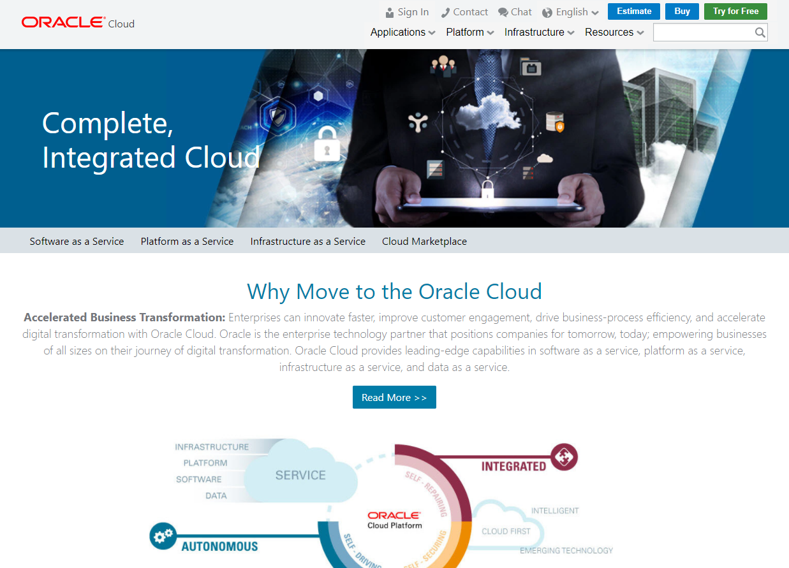

# オラクル クラウド・ネイティブ DevOps ワークショップ #
-----
Oracle Cloud Accountにサインインする際に、**Traditional Cloud Accounts**（Cloud Service Accountsとも呼ばれます）と**Cloud Accounts with Identity Cloud Service**の 2種類のクラウド・アカウントにアクセスできます。ほとんどのOracle Cloudサービスは、Identity Cloudサービスを使用してOracle Cloudアカウントで実行するように設計されています。つまり、サービスはOracle Identity Cloudサービスを使用してユーザーを管理し、サービスへのアクセスを制御します。ただし、一部のOracleクラウド・サービスでは、同じ目的で従来のOracle Identity and Access Managementソフトウェアに依然として依存しています。

## Cloud Accounts with Identity Cloud Service ##

1. ブラウザで[cloud.oracle.com](https://cloud.oracle.com)をアクセスし、**Sign In**をクリックします。
  

2. アカウント種類に**Cloud Accounts with Identity Cloud Service**を選択し、**Cloud Account Name**を入力します。
  

3. 認証情報を入力し、**Sign In**をクリックします。
  

4. ダッシュボードが表示されます。もし、対象サービスがダッシュボードに表示されていない場合、**Customize Dashboard** をクリックしてください。
  

## Traditional Cloud Accounts ##

1. ブラウザで[cloud.oracle.com](https://cloud.oracle.com)をアクセスし、**Sign In**をクリックします。
  

2. アカウント種類に**Traditional Cloud Accounts**を選択し、**Data Center**を選択します。
  

3. 認証情報を入力し、**Sign In**をクリックします。
  

4. ダッシュボードが表示されます。もし、対象サービスがダッシュボードに表示されていない場合、**Customize Dashboard** をクリックしてください。
  
